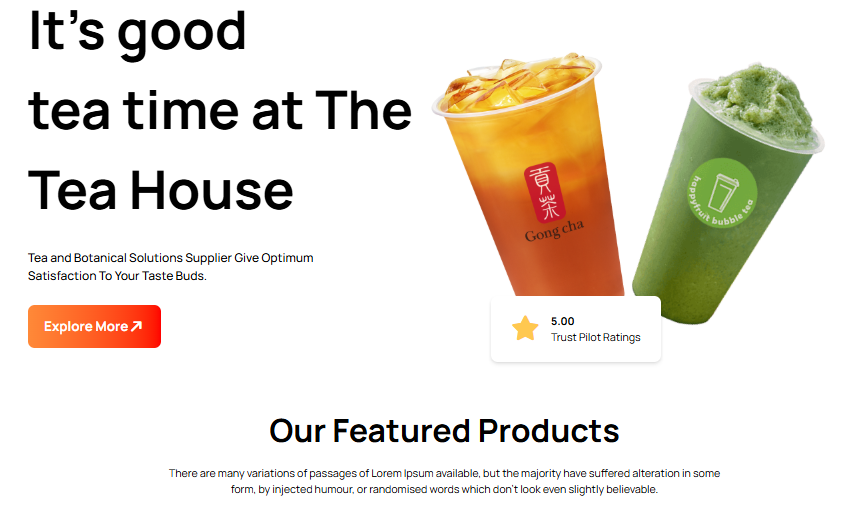

# 🍵 Tea House

*Welcome to ***Tea House***, a beautifully crafted website dedicated to showcasing a wide range of premium tea collections. Explore our selection, discover unique flavors, and enjoy a smooth and visually pleasing browsing experience.*

## 📌 About This Project

**Tea House** is a modern and responsive website designed to showcase a wide variety of premium tea collections. The website focuses on a clean user interface, smooth navigation, and an engaging visual experience for tea lovers.

---

## 🖼️ Website Preview


---

## ✨ Features

- **Banner Section** – Eye-catching hero banner
- **Featured Section** – Highlighted and popular tea items
- **Great Tea Section** – Detailed showcase of different tea varieties
- **Meet Our Clients Section** – Customer reviews and feedback
- **News & Events Section** – Latest updates and tea-related events
- **Footer Section** – Important links and information

---

## 🛠️ Technologies Used

```
- HTML5  
- CSS3  
- Tailwind CSS  
- JavaScript  
- Font Awesome (Icons)  
- Google Fonts (Typography)  
```

---

## 📱 Responsive Design

The website is fully **responsive** and optimized for all devices, including mobile phones, tablets, and desktops.

---


## 🌐 Live Website

👉 [Click here to visit the website](https://ifthe16.github.io/tea-house/)
